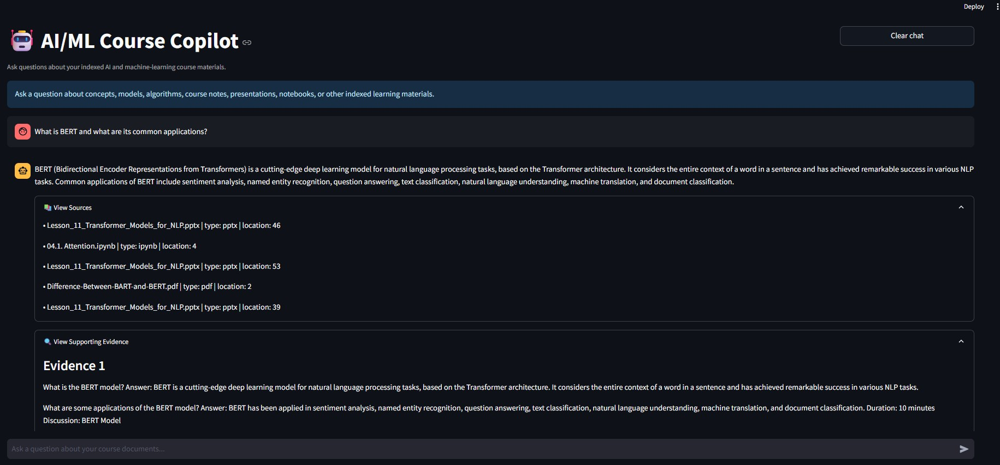
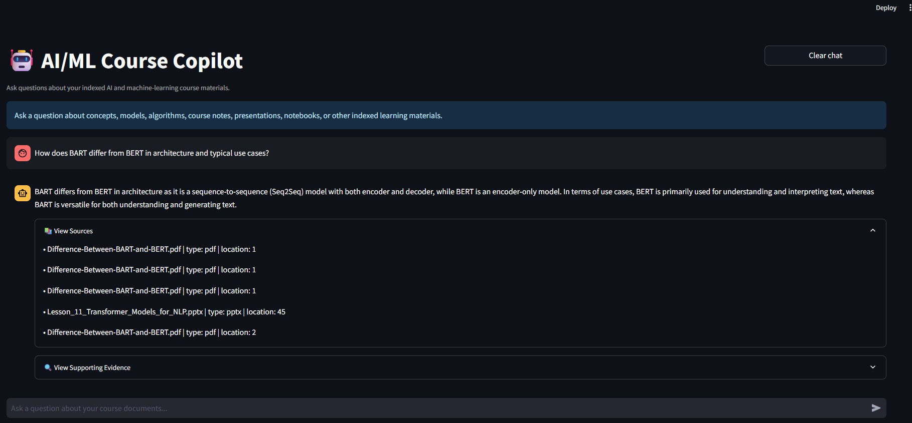
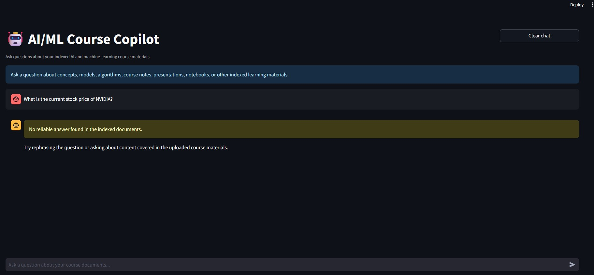
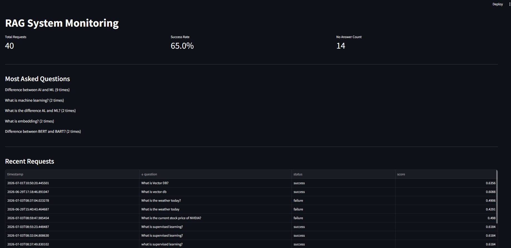
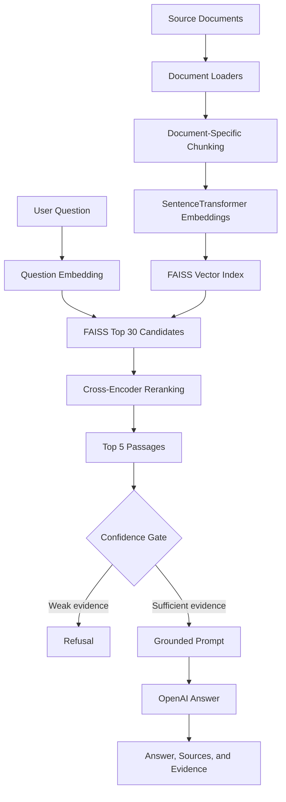

# 🤖 AI/ML Course Copilot


AI/ML Course Copilot is a document-grounded Retrieval-Augmented Generation (RAG) application that answers questions using indexed course materials on artificial intelligence and machine learning.

I created this project to demonstrate how an end-to-end RAG system can be designed, implemented, evaluated, and monitored through a transparent and testable retrieval pipeline.

The system supports multiple document formats and combines FAISS retrieval, cross-encoder reranking, confidence-based refusal, grounded OpenAI responses, source attribution, and usage monitoring.

## 🎥 Demo Video

[▶ Watch the AI/ML Course Copilot Demo](https://www.loom.com/share/ba9c8d7e45bb445598d36dc8b52a29c7)

## ✨ Key Features

- Multi-format document ingestion
- Recursive folder scanning
- Document specific chunking strategies
- Local SentenceTransformer embeddings
- FAISS semantic vector search
- Cross-encoder reranking
- Confidence based answer or refusal decisions
- Document grounded OpenAI responses
- Source & reference display
- Supporting evidence inspection
- Streamlit chat interface
- Separate monitoring dashboard
- Local JSONL usage logging
- Repeatable evaluation suite
- Self-contained tests using temporary sample files

## 📸 Application Preview

### Grounded Answer with Sources and Evidence

The application retrieves relevant document passages, generates an answer using the retrieved context, and displays the supporting sources and evidence.



### Multi-Passage Comparison

The retrieval pipeline can combine information from multiple retrieved passages to answer comparison questions.



### Confidence-Based Refusal

When the indexed documents do not provide sufficient evidence, the system refuses to generate an unsupported answer.



### Monitoring Dashboard

The dashboard provides visibility into request volume, answer success rate, refusals, frequently asked questions, recent activity, and retrieval scores.



## Supported File Formats

The ingestion pipeline currently supports:

- PDF
- DOCX
- PPTX
- IPYNB
- JPG, JPEG, and PNG
- XLSX, XLS, and CSV

Image files are processed using Tesseract OCR.

## 🏗️ RAG Architecture



The runtime retrieval flow is:

```text
Question
→ Question embedding
→ FAISS top 30 candidates
→ Cross-encoder reranking
→ Top 5 passages
→ Confidence gate
→ Grounded answer or refusal
```

The confidence gate considers both the FAISS similarity score and the cross-encoder reranking score before allowing answer generation.

## 🧰 Models and Technologies

| Component | Technology | Purpose |
|---|---|---|
| Application interface | Streamlit | Chat interface and monitoring dashboard |
| Language model | OpenAI `gpt-4o-mini` | Grounded answer generation |
| Embedding model | `all-MiniLM-L6-v2` | Question and document embeddings |
| Reranker | `ms-marco-MiniLM-L-6-v2` | Candidate-passage reranking |
| Vector search | FAISS `IndexFlatIP` | Semantic similarity retrieval |
| Text splitting | LangChain recursive text splitter | Document chunking |
| PDF processing | PyMuPDF | PDF text extraction |
| Word processing | python-docx | DOCX text extraction |
| Presentation processing | python-pptx | PPTX text extraction |
| Notebook processing | nbformat | IPYNB content extraction |
| Spreadsheet processing | pandas, openpyxl, xlrd | Spreadsheet ingestion |
| Image processing | Tesseract OCR, Pillow | Text extraction from images |
| Monitoring | JSONL logging | Local request and outcome tracking |

I used LangChain selectively for OpenAI integration and recursive text splitting. I implemented retrieval, reranking, confidence gating, source handling, and evaluation directly so that I could maintain greater control over the pipeline and understand each processing stage.

## Project Structure

```text
ai-ml-course-copilot/
│
├── core/
│   ├── loaders/
│   │   ├── __init__.py
│   │   ├── docx_loader.py
│   │   ├── image_loader.py
│   │   ├── ipynb_loader.py
│   │   ├── pdf_loader.py
│   │   ├── pptx_loader.py
│   │   └── spreadsheet_loader.py
│   │
│   ├── __init__.py
│   ├── chunking.py
│   ├── embeddings.py
│   ├── ingestion.py
│   ├── rag_pipeline.py
│   ├── reranker.py
│   ├── usage_logger.py
│   └── vector_store.py
│
├── data/
│   ├── uploads/
│   │   └── README.md
│   ├── index/
│   │   └── README.md
│   └── metrics/
│       └── README.md
│
├── images/
│   ├── admin-dashboard.png
│   ├── app-comparison-answer.png
│   ├── app-grounded-answer.png
│   ├── app-refusal.png
│   └── app-simple-answer.png
│
├── scripts/
│   └── check_openai_connection.py
│
├── tests/
│   ├── __init__.py
│   ├── test_chunking.py
│   ├── test_docx_loader.py
│   ├── test_embeddings.py
│   ├── test_ingestion.py
│   ├── test_pdf_loader.py
│   ├── test_pptx_loader.py
│   ├── test_rag_pipeline.py
│   ├── test_spreadsheet_loader.py
│   └── test_vector_store.py
│
├── admin_dashboard.py
├── app.py
├── build_index.py
├── evaluate_rag.py
├── evaluation_questions.json
├── requirements.txt
├── .gitignore
├── LICENSE
└── README.md
```

Private documents, generated FAISS files, usage logs, environment files, and detailed evaluation output are excluded from Git tracking.

## Installation

### 1. Clone the repository

```bash
git clone https://github.com/sheellearning/ai-ml-course-copilot.git
cd ai-ml-course-copilot
```

### 2. Create a virtual environment

Windows PowerShell:

```powershell
python -m venv .venv
.venv\Scripts\Activate.ps1
```

macOS or Linux:

```bash
python3 -m venv .venv
source .venv/bin/activate
```

### 3. Install dependencies

```bash
python -m pip install --upgrade pip
python -m pip install -r requirements.txt
```

Verify the installed dependencies:

```bash
python -m pip check
```

## OpenAI API Key

The application reads the OpenAI API key from the following environment variable:

```text
OPENAI_API_KEY
```

Do not place the key directly inside Python files or commit it to GitHub.

For the current PowerShell session:

```powershell
$env:OPENAI_API_KEY="your-api-key"
```

To store it as a Windows user environment variable:

```powershell
setx OPENAI_API_KEY "your-api-key"
```

Restart VS Code or PowerShell after using `setx`.

To verify the OpenAI connection:

```bash
python scripts/check_openai_connection.py
```

This script makes a small API request and may create a minor API charge.

## Tesseract OCR Setup

Tesseract OCR is required to process JPG, JPEG, and PNG files.

The current image loader expects Tesseract to be installed at:

```text
C:\Program Files\Tesseract-OCR\tesseract.exe
```

If Tesseract is installed somewhere else, update the following setting in `core/loaders/image_loader.py`:

```python
pytesseract.pytesseract.tesseract_cmd = (
    r"C:\Program Files\Tesseract-OCR\tesseract.exe"
)
```

## Add Documents

Place source documents inside:

```text
data/uploads/
```

Subfolders are supported because the ingestion pipeline scans the directory recursively.

Source documents remain local and are excluded from Git tracking.

## Build the FAISS Index

After adding or changing source documents, build the local FAISS index:

```bash
python build_index.py
```

The indexing process:

1. Loads supported files recursively.
2. Extracts text and metadata.
3. Applies document-specific chunking.
4. Generates vector embeddings.
5. Builds the FAISS index.
6. Saves the generated index and document records locally.

Generated files:

```text
data/index/faiss.index
data/index/records.pkl
```

These files are excluded from the public repository.

## Run the User Application

```bash
streamlit run app.py
```

The application allows users to:

- Ask questions about indexed documents
- Receive document-grounded answers
- View source references
- Inspect supporting passages
- Receive a refusal when retrieved evidence is insufficient
- Clear the current conversation

## Run the Monitoring Dashboard

```bash
streamlit run admin_dashboard.py
```

The dashboard displays:

- Total requests
- Success rate
- No-answer count
- Frequently asked questions
- Recent request activity
- Retrieval scores

Usage logs are stored locally in:

```text
data/metrics/usage_logs.jsonl
```

The logs are excluded from Git tracking to protect user privacy.

## Run the Tests

Run the tests from the project root:

```bash
python -m tests.test_chunking
python -m tests.test_ingestion
python -m tests.test_pdf_loader
python -m tests.test_docx_loader
python -m tests.test_pptx_loader
python -m tests.test_spreadsheet_loader
python -m tests.test_embeddings
python -m tests.test_vector_store
python -m tests.test_rag_pipeline
```

The tests use temporary sample files and do not require access to private course documents.

The RAG pipeline test uses a fake language-model object and does not make a paid OpenAI API request.

## 🧪 Evaluation

Run the evaluation suite with:

```bash
python evaluate_rag.py
```

The current evaluation dataset contains:

- 5 direct-answer questions
- 3 multi-chunk comparison questions
- 2 unsupported questions

Current baseline result:

| Metric | Result |
|---|---:|
| Total evaluation questions | 10 |
| Passed | 10 |
| Failed | 0 |
| Overall pass rate | 100% |
| Supported-answer pass rate | 100% |
| Unsupported-question refusal rate | 100% |

The 100% result applies only to the current fixed 10-question evaluation set. It should not be interpreted as universal system accuracy.

The evaluator currently uses normalized expected-term matching to measure answer coverage.

Detailed evaluation output is saved locally to:

```text
evaluation_results.json
```

This file is excluded from Git because it may contain source filenames, retrieved evidence, generated answers, and information derived from private documents.

## 🔐 Privacy and Security

The repository excludes:

- OpenAI API keys
- Environment-variable files
- Private uploaded documents
- Generated FAISS indexes
- Serialized document records
- Usage logs
- Detailed evaluation output
- Virtual-environment files
- Python cache files

The OpenAI API key is loaded from the local environment and is never stored directly in the application code.

## Known Limitations

- The FAISS index must be rebuilt after adding or changing documents.
- OCR quality depends on image quality and the local Tesseract installation.
- Spreadsheet ingestion is limited to the first 300 rows of each sheet.
- The evaluation dataset is small and domain-specific.
- Expected-term evaluation uses literal normalized matching rather than semantic scoring.
- The monitoring dashboard does not currently include authentication.
- Usage logs are stored locally rather than in a managed database.
- The application currently uses a local index and is not configured for distributed deployment.

## Future Improvements

Possible future enhancements include:

- User-facing document upload interface
- Incremental indexing for newly added files
- Semantic evaluation metrics
- Larger and more diverse evaluation datasets
- Monitoring-dashboard authentication
- Centralized retrieval configuration
- Conversation-aware retrieval
- Improved OCR preprocessing
- Secure cloud deployment
- Query and API-cost controls
- CI testing through GitHub Actions

## License

This project is licensed under the MIT License. See the `LICENSE` file for details.
